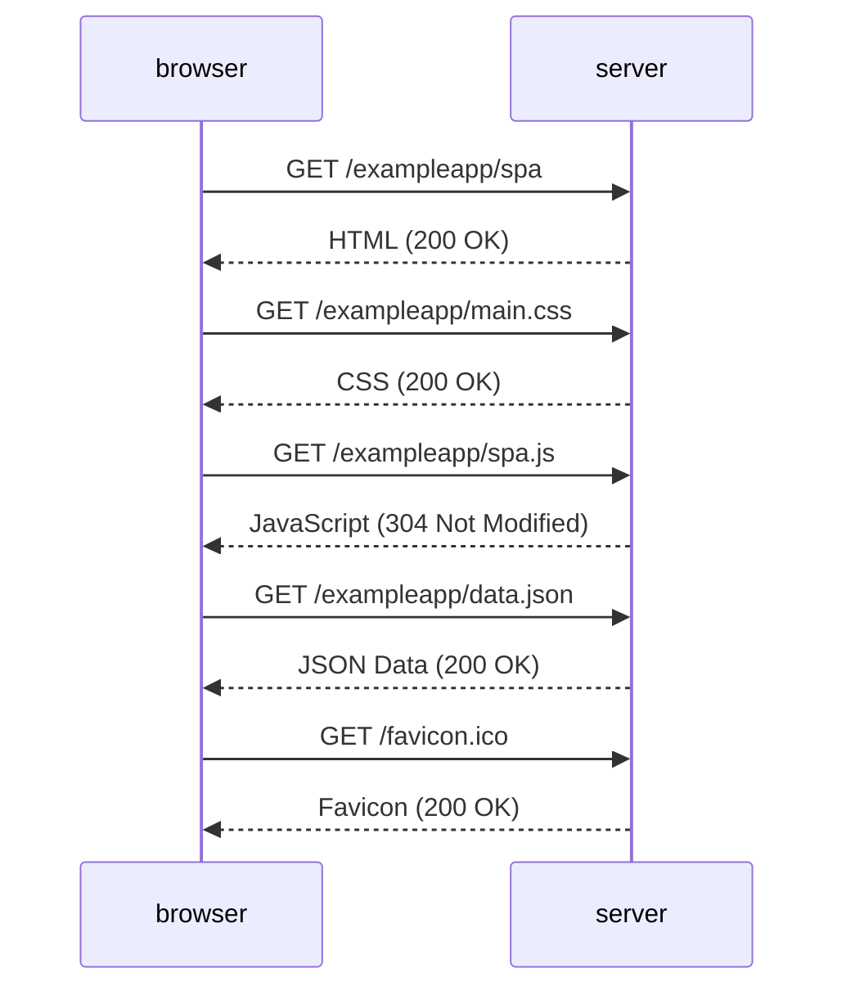

```mermaid
sequenceDiagram
    participant browser
    participant server

    browser->>server: GET /exampleapp/spa
    server-->>browser: HTML (200 OK)

    browser->>server: GET /exampleapp/main.css
    server-->>browser: CSS (200 OK)

    browser->>server: GET /exampleapp/spa.js
    server-->>browser: JavaScript (304 Not Modified)

    browser->>server: GET /exampleapp/data.json
    server-->>browser: JSON Data (200 OK)

    browser->>server: GET /favicon.ico
    server-->>browser: Favicon (200 OK)
```
